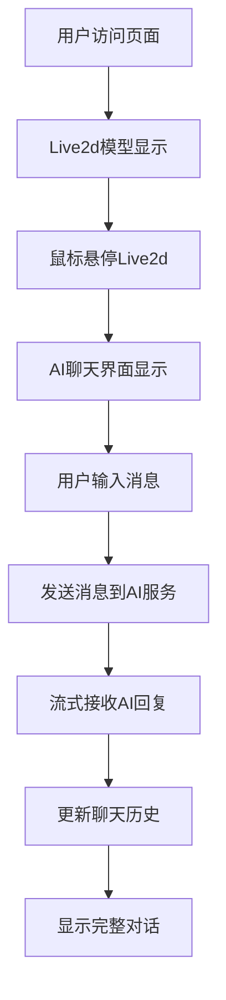

# AI聊天功能产品需求文档

## 1. 产品概述

本项目旨在为Live2d虚拟角色添加智能聊天功能，用户可以通过鼠标交互与Live2d模型进行实时AI对话。

该功能将Live2d虚拟角色与AI聊天服务深度整合，为用户提供沉浸式的虚拟角色交互体验，提升网站的用户粘性和互动性。

## 2. 核心功能

### 2.1 用户角色

| 角色 | 注册方式 | 核心权限 |
|------|----------|----------|
| 普通用户 | 无需注册 | 可与AI模型进行基础对话交互 |

### 2.2 功能模块

我们的AI聊天功能包含以下主要页面：
1. **Live2d展示区域**：虚拟角色展示、鼠标交互响应、隐藏控制按钮
2. **AI聊天界面**：消息输入框、发送按钮、实时对话显示
3. **聊天历史面板**：历史对话记录、消息列表展示

### 2.3 页面详情

| 页面名称 | 模块名称 | 功能描述 |
|----------|----------|----------|
| Live2d展示区域 | 虚拟角色显示 | 展示Live2d模型，支持鼠标跟随和点击交互 |
| Live2d展示区域 | 悬停响应 | 鼠标悬停时触发AI聊天界面显示 |
| Live2d展示区域 | 隐藏控制按钮 | 提供隐藏/显示Live2d模型的控制按钮 |
| AI聊天界面 | 消息输入 | 文本输入框，支持回车发送消息 |
| AI聊天界面 | 发送控制 | 发送按钮，触发AI对话请求 |
| AI聊天界面 | 实时响应 | 支持流式输出，实时显示AI回复 |
| 聊天历史面板 | 对话记录 | 显示当前会话的所有对话历史 |
| 聊天历史面板 | 消息列表 | 区分用户消息和AI回复，支持滚动查看 |

## 3. 核心流程

用户首先看到固定在页面右下角的Live2d虚拟角色。当用户将鼠标悬停在Live2d模型上时，AI聊天界面会在模型左上方显示出来。用户可以在输入框中输入消息，点击发送按钮或按回车键发送。系统将消息发送到后端AI服务，并通过流式输出实时显示AI的回复。所有对话记录会显示在聊天历史面板中，用户可以查看完整的对话历史。

## 4. 用户界面设计

### 4.1 设计风格

- 主色调：青蓝色系 (#6ba6c5)
- 辅助色：浅青绿 (#84a98c)、深青蓝 (#1b4965)
- 按钮样式：圆角设计，支持悬停效果
- 字体：系统默认字体，16px主要文字，14px次要文字
- 布局风格：卡片式设计，浮动面板布局
- 图标风格：简洁线条图标，支持主题色彩

### 4.2 页面设计概览

| 页面名称 | 模块名称 | UI元素 |
|----------|----------|--------|
| Live2d展示区域 | 虚拟角色显示 | 透明背景，400x400px固定尺寸，右下角定位 |
| Live2d展示区域 | 隐藏控制按钮 | 圆形按钮，主题色背景，悬停效果，位于模型右上角 |
| AI聊天界面 | 消息输入框 | 圆角输入框，主题边框色，占位符文字，自动聚焦 |
| AI聊天界面 | 发送按钮 | 主题色背景，白色文字，悬停变深，禁用状态灰色 |
| 聊天历史面板 | 对话气泡 | 用户消息右对齐蓝色，AI回复左对齐灰色，圆角设计 |
| 聊天历史面板 | 滚动区域 | 自动滚动到最新消息，最大高度450px，自定义滚动条 |

### 4.3 响应式设计

产品采用桌面优先设计，在移动设备上AI聊天界面会调整为全屏模式，确保良好的触摸交互体验。Live2d模型在小屏幕设备上会适当缩小尺寸。