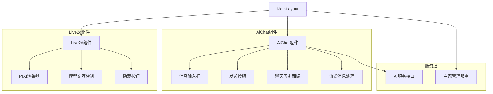
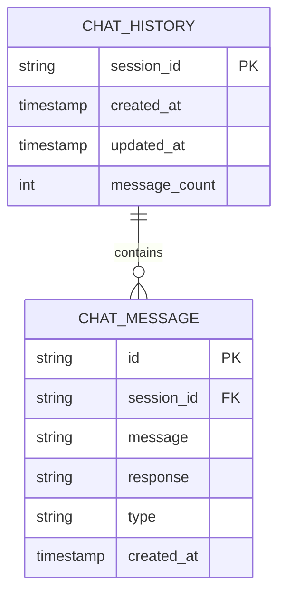

# AI聊天功能技术架构文档

## 1. 架构设计

````

## 7. 完整任务实施清单

### 7.1 后端JWT认证配置任务

**步骤1：复制JWT工具类**
- [ ] 从主服务复制JwtUtil.java到AI服务
- [ ] 从主服务复制JwtAuthenticationFilter.java到AI服务
- [ ] 从主服务复制SecurityConfig.java到AI服务

**步骤2：更新AI服务依赖**
```xml
<!-- 在LiuTech-AI/pom.xml中添加JWT依赖 -->
<dependency>
    <groupId>io.jsonwebtoken</groupId>
    <artifactId>jjwt-api</artifactId>
    <version>0.11.5</version>
</dependency>
<dependency>
    <groupId>io.jsonwebtoken</groupId>
    <artifactId>jjwt-impl</artifactId>
    <version>0.11.5</version>
</dependency>
<dependency>
    <groupId>io.jsonwebtoken</groupId>
    <artifactId>jjwt-jackson</artifactId>
    <version>0.11.5</version>
</dependency>
<dependency>
    <groupId>org.springframework.boot</groupId>
    <artifactId>spring-boot-starter-security</artifactId>
</dependency>
````

**步骤3：配置JWT参数**

* [ ] 在application.yml中配置JWT密钥和过期时间

* [ ] 确保与主服务JWT配置一致

* [ ] 配置AI服务端口为8081

**步骤4：修改AiChatController**

* [ ] 添加@PreAuthorize注解进行权限控制

* [ ] 从JWT Token解析用户ID

* [ ] 替换硬编码的用户ID 0

* [ ] 在聊天记录中关联真实用户ID

### 7.2 前端API重构任务

**步骤1：修改API服务配置**

* [ ] 创建多服务配置文件 `src/config/services.ts`

* [ ] 定义主服务(8080)和AI服务(8081)的配置

* [ ] 实现服务路由选择逻辑

**步骤2：重构统一API请求封装**

* [ ] 修改 `src/services/api.ts`

* [ ] 添加服务选择参数

* [ ] 实现动态端口切换

* [ ] 保持JWT Token自动添加功能

**步骤3：更新AI服务接口**

* [ ] 修改 `src/services/ai.ts`

* [ ] 使用AI服务专用的API配置

* [ ] 确保请求路由到8081端口

* [ ] 添加错误处理和重试机制

### 7.3 Live2d和AI聊天组件交互实现

**步骤1：Live2d组件增强**

* [ ] 添加鼠标悬停事件监听

* [ ] 实现AI聊天组件显示/隐藏控制

* [ ] 添加隐藏按钮组件

* [ ] 优化组件位置和样式

**步骤2：AiChat组件重构**

* [ ] 实现消息输入和发送功能

* [ ] 添加流式消息接收处理

* [ ] 实现聊天历史记录显示

* [ ] 添加加载状态和错误处理

* [ ] 应用主题样式系统

**步骤3：组件间通信**

* [ ] 使用Vue3 Composition API实现组件通信

* [ ] 实现Live2d悬停触发AI聊天显示

* [ ] 添加聊天状态管理

* [ ] 实现消息历史持久化

### 7.4 样式和主题适配

**步骤1：主题样式应用**

* [ ] 在AI聊天组件中应用CSS变量

* [ ] 实现深色/浅色主题切换

* [ ] 优化聊天气泡样式

* [ ] 添加动画效果

**步骤2：响应式设计**

* [ ] 适配移动端显示

* [ ] 优化触摸交互

* [ ] 调整组件布局

### 7.5 测试和优化

**步骤1：功能测试**

* [ ] 测试JWT认证流程

* [ ] 测试AI聊天功能

* [ ] 测试组件交互

* [ ] 测试主题切换

**步骤2：性能优化**

* [ ] 优化API请求性能

* [ ] 实现消息缓存

* [ ] 优化Live2d渲染性能

**步骤3：错误处理**

* [ ] 添加网络错误处理

* [ ] 实现认证失败处理

* [ ] 添加用户友好的错误提示

### 7.6 部署配置

**步骤1：环境配置**

* [ ] 配置开发环境端口

* [ ] 配置生产环境域名

* [ ] 更新CORS配置

**步骤2：服务启动**

* [ ] 确保主服务(8080)正常运行

* [ ] 启动AI服务(8081)

* [ ] 验证服务间通信

**预计完成时间：** 3-5个工作日
**优先级：** 高
**依赖关系：** JWT配置 → API重构 → 组件实现 → 样式适配 → 测试优化mermaid
graph TD
A\[用户浏览器] --> B\[Vue3前端应用]
B --> C\[AI服务接口]
C --> D\[后端AI服务]

```
subgraph "前端层"
    B
    E[Live2d组件]
    F[AiChat组件]
    G[主题系统]
end

subgraph "后端层"
    D
    H[聊天历史接口]
end

subgraph "外部服务"
    I[AI模型服务]
end

D --> I
```

```

## 2. 技术描述

- 前端：Vue3 + TypeScript + Vite + SCSS
- 后端：Spring Boot + AI聊天服务 (端口8081)
- 主服务：Spring Boot + JWT认证服务 (端口8080)
- 认证：JWT Token + 用户ID解析
- 通信：HTTP REST API + SSE流式传输 + 多端口支持
- 样式：CSS变量主题系统 + 响应式设计

## 3. 路由定义

| 路由 | 用途 |
|------|------|
| / | 主页面，包含Live2d模型和AI聊天功能 |
| /chat | AI聊天历史页面（可选扩展） |

## 4. API定义

### 4.1 JWT认证配置

**JWT工具类配置**
- 从主服务(8080端口)复制JWT工具类到AI服务(8081端口)
- 更新AI服务依赖：添加JWT相关依赖包
- 配置JWT密钥和过期时间与主服务保持一致
- 实现用户ID解析功能，替换硬编码的用户ID 0

**前端API多端口支持**
- 修改前端统一API请求封装
- 支持不同微服务的端口配置
- AI相关请求路由到8081端口
- 其他请求保持8080端口

### 4.2 核心API

**AI聊天接口 - 普通模式**
```

POST <http://localhost:8081/ai/chat>

````

请求头：
| 参数名 | 参数类型 | 是否必需 | 描述 |
|--------|----------|----------|------|
| Authorization | string | true | Bearer JWT Token |

请求参数：
| 参数名 | 参数类型 | 是否必需 | 描述 |
|--------|----------|----------|------|
| message | string | true | 用户输入的聊天消息 |

响应参数：
| 参数名 | 参数类型 | 描述 |
|--------|----------|------|
| success | boolean | 请求是否成功 |
| data | string | AI回复的消息内容 |
| timestamp | number | 响应时间戳 |

请求示例：
```json
{
  "message": "你好，今天天气怎么样？"
}
````

**AI聊天接口 - 流式模式**

```
POST http://localhost:8081/ai/chat/stream
```

请求头：

| 参数名           | 参数类型   | 是否必需 | 描述               |
| ------------- | ------ | ---- | ---------------- |
| Authorization | string | true | Bearer JWT Token |

请求参数：

| 参数名     | 参数类型   | 是否必需 | 描述        |
| ------- | ------ | ---- | --------- |
| message | string | true | 用户输入的聊天消息 |

响应：SSE流式数据

**聊天历史接口**

````

## 7. 完整任务实施清单

### 7.1 后端JWT认证配置任务

**步骤1：复制JWT工具类**
- [ ] 从主服务复制JwtUtil.java到AI服务
- [ ] 从主服务复制JwtAuthenticationFilter.java到AI服务
- [ ] 从主服务复制SecurityConfig.java到AI服务

**步骤2：更新AI服务依赖**
```xml
<!-- 在LiuTech-AI/pom.xml中添加JWT依赖 -->
<dependency>
    <groupId>io.jsonwebtoken</groupId>
    <artifactId>jjwt-api</artifactId>
    <version>0.11.5</version>
</dependency>
<dependency>
    <groupId>io.jsonwebtoken</groupId>
    <artifactId>jjwt-impl</artifactId>
    <version>0.11.5</version>
</dependency>
<dependency>
    <groupId>io.jsonwebtoken</groupId>
    <artifactId>jjwt-jackson</artifactId>
    <version>0.11.5</version>
</dependency>
<dependency>
    <groupId>org.springframework.boot</groupId>
    <artifactId>spring-boot-starter-security</artifactId>
</dependency>
````

请求头：

| 参数名           | 参数类型   | 是否必需 | 描述               |
| ------------- | ------ | ---- | ---------------- |
| Authorization | string | true | Bearer JWT Token |

请求参数：

| 参数名    | 参数类型   | 是否必需  | 描述            |
| ------ | ------ | ----- | ------------- |
| limit  | number | false | 获取历史记录数量，默认50 |
| offset | number | false | 分页偏移量，默认0     |

响应参数：

| 参数名     | 参数类型           | 描述       |
| ------- | -------------- | -------- |
| success | boolean        | 请求是否成功   |
| data    | ChatMessage\[] | 聊天历史记录数组 |
| total   | number         | 总记录数     |

ChatMessage类型定义：

```typescript
interface ChatMessage {
  id: string
  message: string
  response: string
  timestamp: number
  type: 'user' | 'ai'
}
```

## 5. 前端组件架构



## 6. 数据模型

### 6.1 数据模型定义



### 6.2 数据定义语言

**聊天历史表 (chat\_history)**

```sql
-- 创建聊天历史表
CREATE TABLE chat_history (
    session_id VARCHAR(36) PRIMARY KEY DEFAULT (UUID()),
    created_at TIMESTAMP DEFAULT CURRENT_TIMESTAMP,
    updated_at TIMESTAMP DEFAULT CURRENT_TIMESTAMP ON UPDATE CURRENT_TIMESTAMP,
    message_count INT DEFAULT 0
);

-- 创建聊天消息表
CREATE TABLE chat_message (
    id VARCHAR(36) PRIMARY KEY DEFAULT (UUID()),
    session_id VARCHAR(36) NOT NULL,
    message TEXT NOT NULL,
    response TEXT,
    type ENUM('user', 'ai') NOT NULL,
    created_at TIMESTAMP DEFAULT CURRENT_TIMESTAMP,
    FOREIGN KEY (session_id) REFERENCES chat_history(session_id) ON DELETE CASCADE
);

-- 创建索引
CREATE INDEX idx_chat_message_session_id ON chat_message(session_id);
CREATE INDEX idx_chat_message_created_at ON chat_message(created_at DESC);
CREATE INDEX idx_chat_history_updated_at ON chat_history(updated_at DESC);

-- 初始化数据
INSERT INTO chat_history (session_id, message_count) VALUES 
('default-session', 0);
```

**TypeScript类型定义**

```typescript
// AI聊天请求接口
export interface AiChatRequest {
  message: string
  sessionId?: string
}

// AI聊天响应接口
export interface AiChatResponse {
  success: boolean
  data: string
  timestamp: number
  sessionId: string
  userId: string
}

// 聊天消息接口
export interface ChatMessage {
  id: string
  sessionId: string
  userId: string
  message: string
  response?: string
  type: 'user' | 'ai'
  timestamp: number
}

// 聊天历史响应接口
export interface ChatHistoryResponse {
  success: boolean
  data: ChatMessage[]
  total: number
  sessionId: string
  userId: string
}

// API服务配置接口
export interface ApiServiceConfig {
  baseURL: string
  port: number
  timeout: number
}
```

