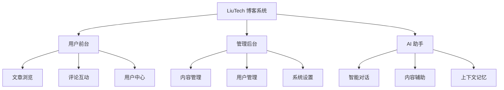
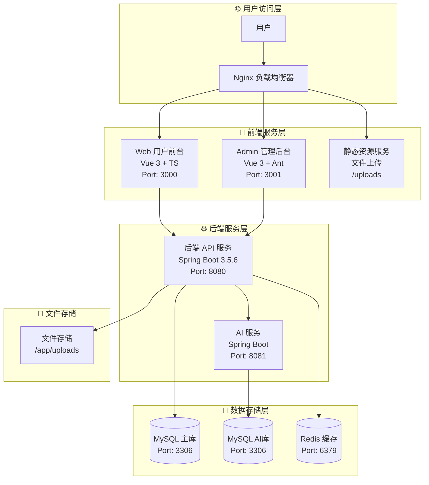

# 🚀 LiuTech 博客系统

<div align="center">

<picture>
  <source media="(prefers-color-scheme: dark)" srcset="https://skillicons.dev/icons?i=vue,ts,vite,spring,java,mysql,redis,docker,nginx&theme=dark">
  <source media="(prefers-color-scheme: light)" srcset="https://skillicons.dev/icons?i=vue,ts,vite,spring,java,mysql,redis,docker,nginx&theme=light">
  
</picture>

**🌟 现代化全栈博客平台 | 前后端分离 | AI 智能助手**

---

### 🛠️ 技术栈

#### 🎨 前端技术
<div align="center">

<a href="https://vuejs.org/">
  
</a>
<a href="https://www.typescriptlang.org/">
  
</a>
<a href="https://vitejs.dev/">
  
</a>
<a href="https://ant.design/">
  
</a>
<a href="https://pinia.vuejs.org/">
  
</a>

</div>

#### ⚙️ 后端技术
<div align="center">

<a href="https://spring.io/projects/spring-boot">
  
</a>
<a href="https://openjdk.org/">
  
</a>
<a href="https://mybatis.org/">
  
</a>
<a href="https://redis.io/">
  
</a>

</div>

#### 🗄️ 数据库与存储
<div align="center">

<a href="https://www.mysql.com/">
  
</a>
<a href="https://www.docker.com/">
  
</a>
<a href="https://nginx.org/">
  
</a>
<a href="https://github.com/">
  
</a>

</div>

---

### 📱 快速访问

<div align="center">

| 🌐 用户前台 | 🔧 管理后台 | 📡 API文档 | 🚀 部署指南 |
|------------|------------|------------|------------|
| [http://localhost:3000](http://localhost:3000) | [http://localhost:3001](http://localhost:3001) | [API文档](./LiuTech/API文档.md) | [部署指南](./快速部署指南.md) |

</div>

---

### 📊 项目状态

<div align="center">

<a href="https://github.com/Liuxin4950/Liutech">
  
</a>
<a href="https://github.com/Liuxin4950/Liutech">
  
</a>
<a href="https://github.com/Liuxin4950/Liutech/issues">
  
</a>
<a href="https://github.com/Liuxin4950/Liutech/blob/main/LICENSE">
  
</a>

</div>

</div>

---

## 📖 项目简介

<div align="center">

**LiuTech** 是一个基于现代化技术栈构建的全栈博客系统，采用前后端分离架构设计。系统包含用户前台展示、管理后台和 AI 聊天助手三大核心模块，为用户提供完整的博客创作、管理和互动体验。

</div>

---

### ✨ 核心特性

| 特性 | 描述 |
|------|------|
| 🎨 **现代化界面** | 基于 Vue 3 + TypeScript，响应式设计，完美适配各种设备 |
| 🔐 **安全可靠** | Spring Security + JWT 认证，数据加密存储 |
| 🤖 **AI 智能助手** | 集成 AI 聊天功能，提供智能内容创作辅助 |
| 📝 **富文本编辑** | TinyMCE 7.9.1 编辑器，支持多媒体内容 |
| 🐳 **容器化部署** | 完整的 Docker 配置，一键部署 |
| 📊 **数据统计** | 完善的用户行为分析和内容统计 |
| 🎭 **交互体验** | Live2D 动画效果，流畅的用户体验 |

---

### 🎯 功能亮点



---

## 🏗️ 系统架构

### 🛠️ 技术栈概览

<div align="center">

| 🎨 前端技术 | ⚙️ 后端技术 | 🚀 部署运维 |
|------------|------------|-----------|
| Vue 3.5.17 | Spring Boot 3.5.6 | Docker |
| TypeScript 5.8.3 | Java 21 | Docker Compose |
| Vite 7.1.3 | Spring Security | Nginx |
| Pinia 3.0.3 | MyBatis-Plus | MySQL 8.0 |
| Vue Router 4.5.1 | Redis Cache | Git |

</div>

### 🏛️ 系统架构图



---

## 🎯 功能特性

### 👤 用户系统
- **用户认证**：注册、登录、JWT 身份验证
- **权限管理**：基于角色的访问控制
- **个人资料**：头像上传、信息编辑、密码修改
- **积分系统**：签到获取积分、积分统计

### 📝 内容管理
- **文章发布**：富文本编辑器、草稿保存、定时发布
- **分类管理**：多级分类、分类统计
- **标签系统**：标签管理、标签云展示
- **文件上传**：图片、文档等多媒体文件支持
- **内容搜索**：全文搜索、分类筛选

### 💬 互动功能
- **评论系统**：文章评论、评论管理
- **点赞收藏**：文章点赞、收藏功能
- **用户互动**：关注、私信（规划中）

### 🤖 AI 助手
- **智能对话**：自然语言交互
- **内容辅助**：写作建议、内容优化
- **上下文记忆**：对话历史管理

### 🎨 界面体验
- **响应式设计**：完美适配桌面端和移动端
- **主题切换**：支持明暗主题（可扩展）
- **动画效果**：Live2D 动画、页面过渡效果
- **无障碍支持**：良好的可访问性设计

---

## 🚀 快速开始

### 环境要求

- **Node.js** ≥ 18.0.0
- **Java** 21 (OpenJDK 或 Oracle JDK)
- **MySQL** ≥ 8.0.0
- **Docker** ≥ 20.10.0 (可选)
- **Git** 最新版本

### 🐳 Docker 一键部署（推荐）

<details>
<summary>📋 点击展开详细步骤</summary>

```bash
# 1️⃣ 克隆项目
git clone https://github.com/Liuxin4950/Liutech.git
cd Liutech

# 2️⃣ 快速构建（Windows）
.\快速打包文件.bat

# 3️⃣ 启动所有服务
docker-compose up -d

# 4️⃣ 查看服务状态
docker-compose ps

# 5️⃣ 访问应用
# 🌐 用户前台: http://localhost:3000
# 🔧 管理后台: http://localhost:3001
# 📡 后端API: http://localhost:8080
# 🤖 AI服务: http://localhost:8081
```

</details>

<details>
<summary>🖥️ Linux/macOS 部署</summary>

```bash
# 1️⃣ 克隆项目
git clone https://github.com/Liuxin4950/Liutech.git
cd Liutech

# 2️⃣ 构建后端服务
cd LiuTech && mvn clean package -DskipTests && cd ..
cd LiuTech-AI && mvn clean package -DskipTests && cd ..

# 3️⃣ 构建前端服务
cd Web && npm ci && npm run build && cd ..
cd Admin && npm ci && npm run build && cd ..

# 4️⃣ 启动服务
docker-compose up -d

# 5️⃣ 查看日志
docker-compose logs -f
```

</details>

### 💻 本地开发部署

<details>
<summary>🗄️ 数据库配置</summary>

```sql
-- 一次性导入主后端和 AI 服务表结构
mysql -u root -p < sql/sql.sql
```

</details>

<details>
<summary>⚙️ 后端服务启动</summary>

后端和 AI 服务需要从项目根目录 `.env` 注入 `DB_PASSWORD`、`JWT_SECRET`、`SPRING_AI_OPENAI_API_KEY` 等配置；首次运行可复制 `.env.example` 为 `.env` 后填写本地值。Windows 开发建议使用下面的启动脚本，它会自动加载 `.env`。
本地和生产环境应保持相同的变量名与 `docker-compose.yml` 服务结构；敏感值可以按环境区分，例如本地数据库密码可与生产不同。

**主后端服务 (LiuTech)**
```bash
# 进入后端目录
cd LiuTech

# 编译并启动
mvn clean compile
../scripts/run-backend-dev.ps1

# 或者打包运行
mvn clean package -DskipTests
java -jar target/liutech-backend-*.jar
# 访问: http://localhost:8080
```

**AI服务 (LiuTech-AI)**
```bash
# 进入AI服务目录
cd LiuTech-AI

# 编译并启动
mvn clean compile
../scripts/run-ai-dev.ps1

# 或者打包运行
mvn clean package -DskipTests
java -jar target/liutech-ai-*.jar
# 访问: http://localhost:8081
```

</details>

<details>
<summary>🎨 前端服务启动</summary>

**用户前台 (Web)**
```bash
cd Web
npm install
npm run dev
# 访问: http://localhost:3000
```

**管理后台 (Admin)**
```bash
cd Admin
npm install
npm run dev
# 访问: http://localhost:3001
```

</details>

---

## 📁 项目结构

```
Liutech/
├── 📁 LiuTech/                 # Spring Boot 主后端服务
│   ├── 📁 src/main/java/       # Java 源码
│   │   └── 📁 chat/liuxin/liutech/
│   │       ├── 📁 controller/  # 控制器层
│   │       ├── 📁 service/     # 业务逻辑层
│   │       ├── 📁 mapper/      # 数据访问层
│   │       ├── 📁 model/       # 数据模型
│   │       ├── 📁 config/      # 配置类
│   │       └── 📁 common/      # 公共组件
│   ├── 📁 src/main/resources/  # 配置文件
│   ├── 📄 Dockerfile          # Docker 构建文件
│   └── 📄 pom.xml             # Maven 依赖配置
├── 📁 LiuTech-AI/             # AI 聊天服务模块
│   ├── 📁 src/main/java/       # AI 服务源码
│   ├── 📄 AI接口文档.md        # AI 接口文档
│   └── 📄 pom.xml             # Maven 依赖配置
├── 📁 Web/                    # Vue 3 用户前端
│   ├── 📁 src/
│   │   ├── 📁 views/          # 页面组件
│   │   ├── 📁 components/     # 公共组件
│   │   ├── 📁 stores/         # 状态管理
│   │   ├── 📁 services/       # API 服务
│   │   └── 📁 router/         # 路由配置
│   ├── 📁 public/             # 静态资源
│   ├── 📄 Dockerfile          # Docker 构建文件
│   └── 📄 package.json        # NPM 依赖配置
├── 📁 Admin/                  # Vue 3 管理后台
│   ├── 📁 src/                # 源码结构同 Web
│   ├── 📄 Dockerfile          # Docker 构建文件
│   └── 📄 package.json        # NPM 依赖配置
├── 📁 nginx/                  # Nginx 配置
│   ├── 📄 nginx.conf          # 主配置文件
│   └── 📁 conf.d/             # 虚拟主机配置
├── � sql/                    # 数据库脚本
│   └── 📄 sql.sql             # 主后端 + AI 服务数据库初始化脚本
├── 📄 docker-compose.yml      # Docker 编排配置
├── 📄 快速部署指南.md          # 快速部署指南
├── 📄 服务器部署脚本.sh        # 服务器部署脚本
├── 📄 快速打包文件.bat         # Windows构建脚本
├── 📄 目前开发清单.md          # 开发进度清单
└── 📄 README.md               # 项目说明文档
```

---

## 🔧 配置说明

### 环境变量配置

创建 `.env` 文件：
```bash
# 服务端口
WEB_PORT=3000
ADMIN_PORT=3001
BACKEND_PORT=8080
AI_PORT=8081
MYSQL_PORT=3306
NGINX_HTTP=80
NGINX_HTTPS=443

# 数据库：生产环境请使用强密码，本地可使用开发密码
DB_PASSWORD=your_mysql_root_password

# JWT：后端和 AI 服务必须保持一致
JWT_SECRET=your_strong_jwt_secret_key_min_32_chars

# SiliconFlow / AI
SPRING_AI_OPENAI_API_KEY=your_siliconflow_api_key
SILICONFLOW_API_KEY=your_siliconflow_api_key
SILICONFLOW_TTS_API_KEY=your_siliconflow_tts_api_key
TTS_PROXY_INTERNAL_TOKEN=your_internal_tts_token

# 应用基础 URL：本地可用 http://localhost:8080，生产建议使用 HTTPS 域名
SERVER_BASE_URL=https://www.liuxin.chat
```

`docker-compose.yml` 中后端和 AI 服务的 JDBC URL 已包含 `allowPublicKeyRetrieval=true`，用于兼容 MySQL 8 的认证流程。

### 应用配置文件

**后端配置 (`application.yml`)**
```yaml
spring:
  datasource:
    url: jdbc:mysql://localhost:3306/liutech?useSSL=false&serverTimezone=UTC
    username: root
    password: ${DB_PASSWORD}
  servlet:
    multipart:
      max-file-size: 100MB
      max-request-size: 100MB

server:
  port: ${SERVER_PORT:8080}

file:
  upload:
    base-path: ${FILE_UPLOAD_PATH:/opt/uploads}
```

**前端配置 (`.env.development`)**
```bash
# Web 前端
VITE_API_BASE_URL=http://127.0.0.1:8080

# Admin 后台
VITE_API_BASE_URL=http://127.0.0.1:8080
```

---

## 📊 API 接口

### 用户认证
```http
POST /api/auth/login          # 用户登录
POST /api/auth/register       # 用户注册
POST /api/auth/logout         # 用户登出
GET  /api/auth/profile        # 获取用户信息
PUT  /api/auth/profile        # 更新用户信息
```

### 文章管理
```http
GET    /api/posts             # 获取文章列表
GET    /api/posts/{id}        # 获取文章详情
POST   /api/posts             # 创建文章
PUT    /api/posts/{id}        # 更新文章
DELETE /api/posts/{id}        # 删除文章
```

### 分类标签
```http
GET    /api/categories        # 获取分类列表
GET    /api/tags              # 获取标签列表
POST   /api/categories        # 创建分类
POST   /api/tags              # 创建标签
```

> 📖 完整的 API 文档请查看：[API 文档](./LiuTech/API文档.md)

---

## 🎨 界面预览

### 用户前台
- **首页**：文章列表、分类导航、热门标签
- **文章详情**：富文本内容、评论互动、相关推荐
- **个人中心**：用户资料、我的文章、收藏管理
- **创作中心**：富文本编辑器、草稿管理

### 管理后台
- **仪表盘**：数据统计、系统概览
- **内容管理**：文章、分类、标签管理
- **用户管理**：用户列表、权限设置
- **系统设置**：公告管理、系统配置

---

## 🚀 部署指南

### 🏭 生产环境部署

<details>
<summary>📋 服务器要求</summary>

- **操作系统**: Linux (Ubuntu 20.04+ / CentOS 7+)
- **内存**: 4GB+ 推荐
- **存储**: 20GB+ 可用空间
- **软件**: Docker ≥ 20.10.0, Docker Compose
- **网络**: 开放相应端口 (80, 443, 8080, 8081；如需远程维护数据库，再按安全组白名单开放 3306)

</details>

<details>
<summary>🚀 快速部署步骤</summary>

国内服务器无法从 DockerHub 拉取镜像，采用**本地离线打包**方式：本地构建镜像 → 导出 tar → 上传服务器 → 容器编排。

```bash
# 1️⃣ 本地构建 5 个业务镜像
.\快速打包文件.bat

# 2️⃣ 导出业务镜像为 tar（必需，不导出 MySQL）
.\镜像导出脚本.bat

# 3️⃣ 上传到服务器 /opt/liutech/
# - docker-images/*.tar → images/
# - sql/sql.sql → sql/
# - nginx/ → nginx/
# - 服务器部署脚本.sh

# 4️⃣ 服务器执行部署
cd /opt/liutech
chmod +x 服务器部署脚本.sh
./服务器部署脚本.sh

# 5️⃣ 验证部署
docker compose ps
curl http://localhost:80
```

首次部署还需确保服务器具备 `mysql:8.0` 镜像（本地 `docker save` 后上传，或配置国内镜像加速器）。业务镜像更新时只重建 `backend ai web admin nginx`；**不要**执行 `docker compose down -v`，**不要**删除 `mysql_data` 数据卷。

> 海外服务器或有 DockerHub 代理时，也可用 GitHub Actions 自动构建推送 + 服务器 `docker pull` 的方式，详见 [快速部署指南](./快速部署指南.md)。

</details>

<details>
<summary>⚙️ Nginx 反向代理配置</summary>

```nginx
server {
    listen 80;
    server_name your-domain.com;
    
    # 前端应用
    location / {
        proxy_pass http://localhost:3000;
        proxy_set_header Host $host;
        proxy_set_header X-Real-IP $remote_addr;
        proxy_set_header X-Forwarded-For $proxy_add_x_forwarded_for;
        proxy_set_header X-Forwarded-Proto $scheme;
    }
    
    # 管理后台
    location /admin {
        proxy_pass http://localhost:3001;
        proxy_set_header Host $host;
        proxy_set_header X-Real-IP $remote_addr;
        proxy_set_header X-Forwarded-For $proxy_add_x_forwarded_for;
        proxy_set_header X-Forwarded-Proto $scheme;
    }
    
    # 后端API
    location /api {
        proxy_pass http://localhost:8080;
        proxy_set_header Host $host;
        proxy_set_header X-Real-IP $remote_addr;
        proxy_set_header X-Forwarded-For $proxy_add_x_forwarded_for;
        proxy_set_header X-Forwarded-Proto $scheme;
    }
    
    # AI服务
    location /ai {
        proxy_pass http://localhost:8081;
        proxy_set_header Host $host;
        proxy_set_header X-Real-IP $remote_addr;
        proxy_set_header X-Forwarded-For $proxy_add_x_forwarded_for;
        proxy_set_header X-Forwarded-Proto $scheme;
    }
}
```

</details>

> 📖 详细部署指南请查看：[快速部署指南](./快速部署指南.md)

---

## 🤝 贡献指南

我们欢迎所有形式的贡献！请遵循以下步骤：

1. **Fork** 本仓库
2. **创建** 功能分支 (`git checkout -b feature/AmazingFeature`)
3. **提交** 更改 (`git commit -m 'Add some AmazingFeature'`)
4. **推送** 到分支 (`git push origin feature/AmazingFeature`)
5. **创建** Pull Request

### 开发规范

- **代码风格**：遵循 ESLint 和 Prettier 配置
- **提交信息**：使用语义化提交信息
- **测试覆盖**：新功能需要包含相应测试
- **文档更新**：重要变更需要更新文档

---

## 📄 许可证

本项目采用 MIT 许可证 - 查看 [LICENSE](LICENSE) 文件了解详情。

---

## 👨‍💻 作者信息

**刘鑫**
- 📧 Email: [your-email@example.com](mailto:your-email@example.com)
- 🐙 GitHub: [@Liuxin4950](https://github.com/Liuxin4950)
- 📝 博客: [LiuTech Blog](http://web.localhost)

---

## 🙏 致谢

感谢以下开源项目和技术社区：

<div align="center">

<a href="https://vuejs.org/">
  
</a>
<a href="https://spring.io/projects/spring-boot">
  
</a>
<a href="https://antdv.com/">
  
</a>
<a href="https://www.docker.com/">
  
</a>
<a href="https://www.mysql.com/">
  
</a>

</div>

---

### 📞 联系方式

<div align="center">

| 📧 Email | 🐙 GitHub | 📝 博客 |
|---------|-----------|---------|
| [your-email@example.com](mailto:your-email@example.com) | [@Liuxin4950](https://github.com/Liuxin4950) | [LiuTech Blog](http://localhost:3000) |

</div>

---

### 🌟 支持项目

<div align="center">

如果这个项目对你有帮助，请给它一个 ⭐ Star！

让我们一起构建更好的博客系统！🚀

</div>

</div>
