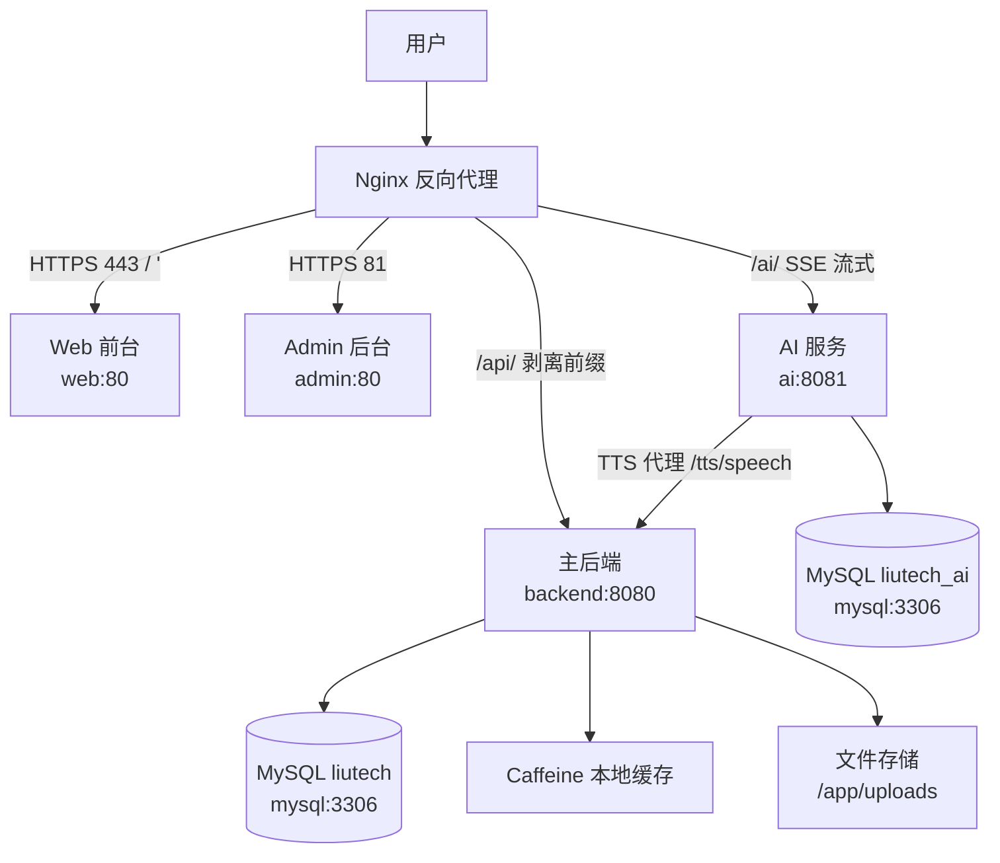

# LiuTech 博客系统

<p align="center">
  
</p>

> 现代化全栈博客平台 · 前后端分离 · 内置 AI 助手与 TTS 语音

**在线演示**：[https://www.liuxin.chat](https://www.liuxin.chat) ｜ **源码仓库**：[GitHub @Liuxin4950](https://github.com/Liuxin4950/Liutech)

---

## 📖 项目简介

LiuTech 是一个基于 Vue 3 + Spring Boot 3 的全栈博客系统，采用前后端分离 + 微服务架构。系统包含**用户前台**、**管理后台**、**AI 聊天助手**三大模块，提供博客创作、互动、积分、资源下载与智能辅助的完整体验。

- 前端：Vue 3 + TypeScript + Vite（Web 前台）/ Ant Design Vue（Admin 后台）
- 后端：Spring Boot 3 主服务（REST API）+ 独立 AI 服务（聊天 / 推荐 / TTS）
- 存储：MySQL 8 + Caffeine 本地缓存
- 部署：Docker Compose 编排 + Nginx 反向代理 + HTTPS

---

## ✨ 核心特性

- **前后端分离**：Vue 3 + TS 前端，Spring Boot 3 双服务后端（主后端 + AI 服务）
- **安全认证**：Spring Security + JWT，支持账号密码登录、邮箱验证码登录、忘记密码/重置
- **AI 智能助手**：大模型聊天（SSE 流式响应）、内容辅助，独立 AI 服务，多模型可配置
- **TTS 语音合成**：SiliconFlow 云端语音，AI 服务通过主后端 `/tts/speech` 代理调用
- **富文本创作**：TinyMCE 7.9 编辑器，草稿、点赞、收藏、热门、搜索
- **本地缓存**：Caffeine 多级 TTL 缓存（文章 5 分钟 / 标签 10 分钟 / 分类 15 分钟），无外部缓存依赖
- **容器化部署**：Docker Compose 一键编排，Nginx 反向代理 + 强制 HTTPS
- **运营功能**：签到积分、资源下载（积分购买）、留言板、背景音乐、首页轮播、公告（支持 Excel 导入导出）、Sitemap

---

## 🛠️ 技术栈

| 层级 | 技术 | 版本 |
|------|------|------|
| 前端框架 | Vue 3 | 3.5.34 |
| 类型系统 | TypeScript | 5.8.3 |
| 构建工具 | Vite | 7.1.3 |
| 状态管理 | Pinia | 3.0.4 |
| 路由 | Vue Router | 4.5.1 |
| UI（Admin） | Ant Design Vue | — |
| 富文本 | TinyMCE | 7.9.1 |
| 后端框架 | Spring Boot | 3.5.9 |
| 运行时 | Java | 21 |
| ORM | MyBatis-Plus | 3.5.12 |
| 安全 | Spring Security + JWT（jjwt） | 0.11.5 |
| 缓存 | Caffeine（本地，多级 TTL） | — |
| Excel | EasyExcel | 4.0.3 |
| 邮件 | Spring Mail | — |
| 数据库 | MySQL | 8.0 |
| 部署 | Docker / Docker Compose / Nginx | — |

> 项目使用 **Caffeine 本地缓存**，未引入 Redis。

---

## 🏗️ 系统架构



容器内通过服务名通信：`backend:8080`、`ai:8081`、`mysql:3306`、`web:80`、`admin:80`。Nginx 对外暴露：`80`（强制跳转 `443`）、`443`（主站 HTTPS）、`81`（管理后台 HTTPS，复用主站点证书）。backend/ai/web/admin/mysql 不映射宿主机端口（端口收敛，走 Docker 内网）。

---

## 🚀 快速开始

### 环境要求

- Node.js ≥ 18
- Java 21（OpenJDK 或 Oracle JDK）
- Maven 3.9+
- MySQL ≥ 8.0
- Docker ≥ 20.10 + Docker Compose

### Docker 一键部署（Windows 推荐）

```bash
# 1. 克隆项目
git clone https://github.com/Liuxin4950/Liutech.git
cd Liutech

# 2. 配置环境变量（填写真实密钥）
cp .env.example .env

# 3. 构建 5 个业务镜像（后端 / AI / Web / Admin / Nginx）
.\快速打包文件.bat

# 4. 启动全部服务
docker-compose up -d

# 5. 查看状态
docker-compose ps
```

### Linux / macOS

Windows 用 `快速打包文件.bat` 一键构建镜像，其他平台执行等价命令：

```bash
git clone https://github.com/Liuxin4950/Liutech.git
cd Liutech
cp .env.example .env          # 编辑填写真实密钥

# 主后端
mvn -f LiuTech/pom.xml clean package -DskipTests
docker build -t liutech-backend:latest -f LiuTech/Dockerfile LiuTech

# AI 服务
mvn -f LiuTech-AI/pom.xml clean package -DskipTests
docker build -t liutech-ai:latest -f LiuTech-AI/Dockerfile LiuTech-AI

# Web 前台
cd Web && npm install && npm run build && docker build -t liutech-web:latest -f Dockerfile . && cd ..

# Admin 后台
cd Admin && npm install && npm run build && docker build -t liutech-admin:latest -f Dockerfile . && cd ..

# Nginx
docker build -t liutech-nginx:latest nginx

# 启动
docker-compose up -d
```

### 本地开发

```bash
# 1. 初始化数据库（一次性，导入 liutech 与 liutech_ai 两个库）
mysql -u root -p < sql/sql.sql

# 2. 主后端（http://localhost:8080）
cd LiuTech
mvn clean package -DskipTests
mvn spring-boot:run

# 3. AI 服务（http://localhost:8081）
cd LiuTech-AI
mvn clean package -DskipTests
mvn spring-boot:run

# 4. 前端
cd Web && npm install && npm run dev      # http://localhost:3000
cd Admin && npm install && npm run dev    # http://localhost:3001
```

> 本地运行后端与 AI 服务需配置 `DB_PASSWORD`、`JWT_SECRET`、`SPRING_AI_OPENAI_API_KEY` 等变量，可在 shell 中导出或在 `application-dev.yml` 中覆盖。`JWT_SECRET` 与 `TTS_PROXY_INTERNAL_TOKEN` 在两个服务间必须一致。

---

## 📁 项目结构

```
Liutech/
├── LiuTech/                    # 主后端 REST API（Spring Boot 3.5.9）
│   ├── src/main/java/chat/liuxin/liutech/
│   │   ├── controller/{admin,web}/   # 控制器层（分后台 / 前台）
│   │   ├── service/                  # 业务逻辑层
│   │   ├── mapper/                   # 数据访问层
│   │   ├── model/                    # 数据模型
│   │   ├── config/                   # 配置类（安全 / 缓存 / 上传等）
│   │   ├── common/ aspect/ filter/   # 公共组件、切面、过滤器
│   │   └── exception/                # 异常处理
│   ├── src/main/resources/           # application*.yml 配置
│   └── Dockerfile
├── LiuTech-AI/                 # AI 聊天 / 推荐 / TTS 服务
│   ├── src/main/java/chat/liuxin/ai/
│   ├── AI接口文档.md            # AI 服务接口文档
│   └── Dockerfile
├── Web/                        # 用户前台（Vue 3 + TS + Vite）
│   ├── src/{views,components,stores,services,router,composables}/
│   └── Dockerfile
├── Admin/                      # 管理后台（Vue 3 + Ant Design Vue）
│   ├── src/
│   └── Dockerfile
├── nginx/                      # Nginx 配置（conf.d/default.conf + Dockerfile）
├── sql/sql.sql                 # MySQL 初始化脚本（liutech + liutech_ai）
├── docker-compose.yml          # 容器编排
├── .env.example                # 环境变量模板
├── 快速打包文件.bat            # Windows 镜像构建脚本
├── 镜像导出脚本.bat            # 镜像导出为 tar（生产离线部署）
├── 服务器部署脚本.sh           # 服务器端部署脚本
├── 快速部署指南.md             # 生产部署详细指南
└── README.md
```

> 上面的树只列主要目录，并非完整清单。

---

## 🔧 配置说明

### 环境变量

从根目录 `.env.example` 复制为 `.env` 并填写（生产环境务必替换为强密钥）：

| 变量 | 说明 |
|------|------|
| `WEB_PORT` / `ADMIN_PORT` / `BACKEND_PORT` / `AI_PORT` / `MYSQL_PORT` | 服务端口（默认 3000 / 3001 / 8080 / 8081 / 3306） |
| `NGINX_HTTP` / `NGINX_HTTPS` | Nginx 对外端口（80 / 443） |
| `DB_PASSWORD` | MySQL root 密码 |
| `JWT_SECRET` | JWT 签名密钥，**主后端与 AI 服务必须一致**（建议 `openssl rand -hex 64`） |
| `TTS_PROXY_INTERNAL_TOKEN` | AI 服务调用主后端 `/tts/speech` 的内部令牌，**两服务必须一致**，否则 TTS 不可用 |
| `SPRING_AI_OPENAI_API_KEY` | 大模型 API 密钥 |
| `SILICONFLOW_API_KEY` | SiliconFlow 通用 API Key（后端与 AI 共用） |
| `SILICONFLOW_TTS_API_KEY` | SiliconFlow TTS 专用 Key（未配置则回退到 `SPRING_AI_OPENAI_API_KEY`） |
| `SERVER_BASE_URL` | 应用基础 URL，本地 `http://localhost`，生产 `https://www.liuxin.chat` |
| `MAIL_HOST` / `MAIL_PORT` / `MAIL_USERNAME` / `MAIL_PASSWORD` / `MAIL_FROM` / `MAIL_DISPLAY_NAME` | 邮箱 SMTP 配置（忘记密码、邮箱验证码登录） |
| `FILE_UPLOAD_BASE_PATH` | 文件上传根目录，容器内 `/app/uploads` |

### 关键约束

- **JDBC URL** 必须包含 `allowPublicKeyRetrieval=true`，兼容 MySQL 8 认证（`docker-compose.yml` 已配置）。
- **`JWT_SECRET` 与 `TTS_PROXY_INTERNAL_TOKEN`** 在 `backend` 和 `ai` 两个服务中必须完全一致。
- **文件上传**：容器内 `/app/uploads` 绑定宿主机 `/liuxin/uploads`。
- **AI 服务调用主后端**：Docker 内 `http://backend:8080`（`BLOG_API_URL`），本地开发 `http://localhost:8080`。

---

## 📡 API 概览

外部请求统一经 Nginx `/api/` 前缀代理到主后端（Nginx 会剥离 `/api` 前缀，如 `/api/user/login` → 后端 `/user/login`）；AI 相关请求走 `/ai/`。

| 模块 | 主要路径（外部） |
|------|------------------|
| 用户认证 | `POST /api/user/login`、`/api/user/register`、`/api/user/forgot-password`、`/api/user/reset-password`、`/api/user/login/email/send`、`/api/user/login/email/verify` |
| 用户信息 | `GET /api/user/current`、`GET/PUT /api/user/profile`、`PUT /api/user/password` |
| 文章 | `/api/posts`（列表 / 详情 / 创建 / 更新 / 删除）、`/api/posts/hot`、`/api/posts/recommendations`（个性化推荐，需登录）、`/api/posts/search`、`/api/posts/{id}/like`、`/api/posts/{id}/favorite` |
| 分类 / 标签 | `/api/categories`、`/api/tags` |
| 互动 | `/api/comments`、`/api/messages`（留言板） |
| 运营 | `/api/carousels`、`/api/announcements`、`/api/music`、`/api/resource/*`（购买 / 下载） |
| 签到积分 | `/api/checkin`、积分相关 |
| 语音 | `/api/tts/status`、`/api/tts/speech` |
| 其他 | `/api/sitemap.xml`、`/api/dashboard`、`/api/stats` |
| AI 服务 | `/ai/*`（聊天 SSE、会话管理、模型配置） — 详见 [AI 接口文档](./LiuTech-AI/AI接口文档.md) |
| 管理后台 | `/admin/*`（文章 / 分类 / 标签 / 评论 / 用户 / 资源 / 积分 / 公告 / 图片 / 系统设置 / 缓存 / 日志 / 模型等 CRUD） |

---

## 🌐 Nginx 反向代理

完整配置见 [`nginx/conf.d/default.conf`](./nginx/conf.d/default.conf)，要点：

- **HTTP 80** 强制 `301` 跳转到 **HTTPS 443**（主站 `liuxin.chat`）
- **HTTPS 443**：证书 `/etc/nginx/ssl/liuxin.chat_bundle.crt` 与 `liuxin.chat.key`，仅 TLS 1.2/1.3
- `/` → Web 前台（`web:80`）；`/api/` → 主后端（剥离 `/api` 前缀）；`/uploads/` → 主后端（长缓存）
- `/ai/` → AI 服务，**SSE 必需**：`proxy_buffering off`、`proxy_request_buffering off`、`proxy_read_timeout 3600s`，且**不强制 `Accept: text/event-stream` 头**（否则破坏 JSON 响应，引发 406）
- **管理后台**独立 `server`，监听 **81 端口 SSL** → `admin:80`（不是路径代理）
- 生产证书位置：`/opt/liutech/nginx/liuxin.chat_bundle.crt` 与 `liuxin.chat.key`

---

## 🏭 生产环境部署

国内服务器无法直连 DockerHub，采用**本地离线打包**：本地构建镜像 → 导出 tar → 上传服务器 → 容器编排。

```bash
# 1. 本地构建 5 个业务镜像
.\快速打包文件.bat

# 2. 导出业务镜像为 tar（不含 MySQL）
.\镜像导出脚本.bat

# 3. 上传到服务器 /opt/liutech/
#    docker-images/*.tar  ->  images/
#    sql/sql.sql          ->  sql/
#    nginx/               ->  nginx/
#    服务器部署脚本.sh

# 4. 服务器执行部署
cd /opt/liutech
chmod +x 服务器部署脚本.sh
./服务器部署脚本.sh

# 5. 验证
docker compose ps
curl -I https://liuxin.chat
```

**注意事项**：

- 首次部署需确保服务器具备 `mysql:8.0` 镜像（本地 `docker save` 后上传，或配置国内镜像加速器）。
- 业务镜像更新时只重建 `backend ai web admin nginx`。
- **不要**执行 `docker compose down -v`，**不要**删除 `mysql_data` 数据卷，否则数据库数据清空。
- 海外服务器或有 DockerHub 代理时，也可用 GitHub Actions 自动构建推送 + 服务器 `docker pull`，详见 [快速部署指南](./快速部署指南.md)。

---

## 🤝 贡献指南

1. Fork 本仓库
2. 创建功能分支：`git checkout -b feature/AmazingFeature`
3. 提交更改（使用语义化提交信息）
4. 推送分支：`git push origin feature/AmazingFeature`
5. 创建 Pull Request

**开发规范**：遵循 ESLint / Prettier 配置；新功能包含相应测试；重要变更同步更新文档。

---

## 📄 许可证

本项目采用 [MIT 许可证](LICENSE)。

---

## 👤 作者

**刘鑫**

- 🐙 GitHub：[@Liuxin4950](https://github.com/Liuxin4950)
- 🌐 博客：[https://www.liuxin.chat](https://www.liuxin.chat)

如果这个项目对你有帮助，欢迎给个 ⭐ Star。
