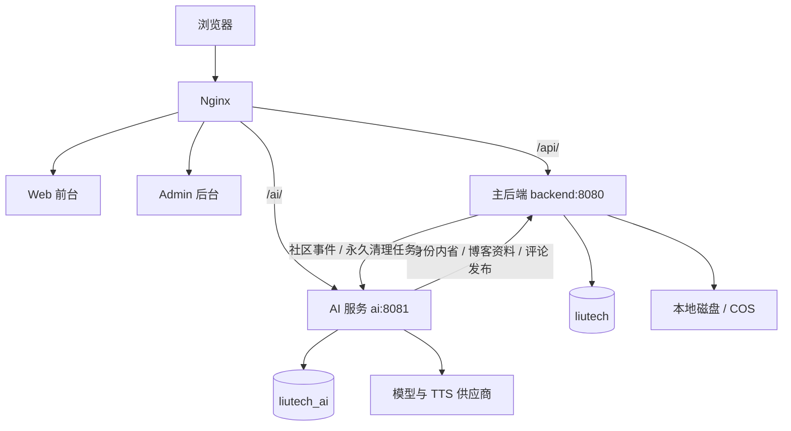

# LiuTech 博客系统

<p align="center">
  
</p>

LiuTech 是 Vue 3 + Spring Boot 的全栈博客平台，包含用户前台、管理后台，以及独立的聊天、写作、社区 AI 和语音服务。

[在线站点](https://liuxin.chat) · [文档入口](Docs/README.md) · [架构总览](Docs/架构/总览.md) · [部署与回退](Docs/架构/运维/部署运维/部署操作.md)

## 功能

- 文章、分类、标签、系列、草稿、搜索、推荐与浏览历史。
- 评论、点赞、收藏、留言、签到积分与资源购买下载。
- 账号密码与邮箱验证码登录、密码重置、角色权限与个人资料。
- 看板娘聊天、SSE 流式响应、Live2D 表情与可选 TTS。
- 管理员写作助手、完整草稿上下文、段落修改建议、采纳与撤销。
- 社区 AI 角色与知识管理、自动评论任务、对话审查和公共记忆。
- 图片引用与存储清理，本地磁盘或腾讯云 COS；后台管理公告、音乐、轮播与站点内容。

## 技术与模块

| 模块 | 技术 | 配置来源 |
| --- | --- | --- |
| `Web/` | Vue 3、TypeScript、Vite、Pinia、TinyMCE | [Web/package.json](Web/package.json) |
| `Admin/` | Vue 3、Ant Design Vue、TypeScript、Vite | [Admin/package.json](Admin/package.json) |
| `LiuTech/` | Java 21、Spring Boot 4.1.0、MyBatis-Plus 3.5.15、JWT | [父 POM](pom.xml)、[主服务 POM](LiuTech/pom.xml) |
| `LiuTech-AI/` | Spring AI、模型执行、SSE、TTS 与社区后台任务 | [AI 服务 POM](LiuTech-AI/pom.xml) |
| 数据与部署 | MySQL 8、Caffeine 本地缓存、Docker Compose、Nginx | [Compose](docker-compose.yml)、[完整 SQL](Docs/SQL/sql.sql) |

前后端分离，两个后端各自使用数据库与最小权限应用账户。项目使用 Caffeine，未引入 Redis。依赖的具体版本以对应清单和锁文件为准。


```mermaid
graph TB
    U[浏览器] --> NX[Nginx]
    NX --> WEB[Web 前台]
    NX --> ADMIN[Admin 后台]
    NX -->|/api/| BE[主后端 backend:8080]
    NX -->|/ai/| AI[AI 服务 ai:8081]
    BE --> DB[(liutech)]
    AI --> DB2[(liutech_ai)]
    AI -->|身份内省 / 博客资料 / 评论发布| BE
    BE -->|社区事件 / 永久清理任务| AI
    AI --> MODEL[模型与 TTS 供应商]
    BE --> FILES[本地磁盘 / COS]
```

## 开发与验证

需要 JDK 21、Maven 3.9+、MySQL 8，以及满足 Vite 要求的 Node.js（20.19+ 或 22.12+）。按 [.env.example](.env.example) 配置当前进程环境变量，真实密钥不入库。

```bash
git clone https://github.com/Liuxin4950/Liutech.git
cd Liutech
npm --prefix Web ci
npm --prefix Admin ci
```

新环境按 [SQL 入口](Docs/SQL/README.md)创建两个完整数据库；已有库按[版本迁移](Docs/SQL/migrations/README.md)升级。初始化不提供固定密码管理员，首次管理员步骤见[部署操作](Docs/架构/运维/部署运维/部署操作.md#首次管理员)。

从仓库根目录进行常规验证：

```bash
mvn test
npm --prefix Web test
npm --prefix Web run build
npm --prefix Admin run build
# 核验 Web/Admin 四对镜像文件逐字节一致
# 核验文档链接、章节锚点、索引及路径大小写
```

未设置 `LIUTECH_TEST_MYSQL_URL` 时会跳过可选 MySQL 回归；数据库变更必须另外运行真实 MySQL 验证，方法见[跨服务规范](Docs/架构/跨服务规范.md#104-数据库验证)。Admin 测试与本地运行命令见 [CLAUDE.md](CLAUDE.md)。

## 部署

六个服务由 Compose 编排。生产仅 Nginx 暴露 80/443/81，其余服务走容器内网；本地端口覆盖在 [docker-compose.override.yml](docker-compose.override.yml)。

构建、上传、备份、数据库迁移、镜像切换与回退使用[部署操作](Docs/架构/运维/部署运维/部署操作.md)。当前线上版本及实际验证范围只在[部署运维](Docs/架构/运维/部署运维/总览.md#当前生产版本)维护。

## 文档

所有现行文档从 [Docs/README.md](Docs/README.md)进入：

| 内容 | 入口 |
| --- | --- |
| 模块与代码地图 | [架构索引](Docs/架构/README.md) |
| 编码、缓存、认证与事务规范 | [跨服务规范](Docs/架构/跨服务规范.md) |
| AI HTTP 与 SSE 契约 | [接口参考](Docs/架构/后端/AI服务/接口参考.md) |
| 数据库初始化与升级 | [SQL 入口](Docs/SQL/README.md) |
| 教程与事故排查 | [教程索引](Docs/教程/README.md) |
| 当前维护事项 | [维护清单](Docs/维护清单.md) |
| 历史需求、评估与提案 | [归档索引](Docs/归档/README.md) |

## 贡献与授权状态

提交应说明改动原因和验证方式，行为变化同步对应模块文档，并通过必要测试与文档检查。工程约定见 [AGENTS.md](AGENTS.md)、[CLAUDE.md](CLAUDE.md)及 [Docs/AGENTS.md](Docs/AGENTS.md)。

许可证待补充：仓库目前未提供 `LICENSE` 文件。

作者：[刘鑫](https://github.com/Liuxin4950) · [个人站点](https://liuxin.chat)
