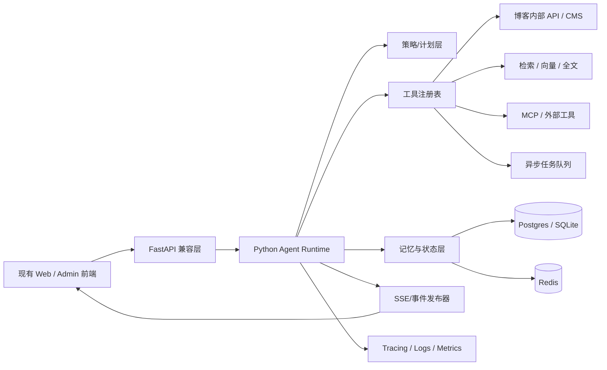

# 博客 AI 模块升级为 Python 智能体的实施研究

## 执行摘要

本研究先按你的约束使用了已启用的 GitHub 连接器，并只检查了 `urlLiuxin4950/Liutechhttps://github.com/Liuxin4950/Liutech`；随后结合 `urlHKUDS/nanobotturn4search0` 的智能体循环实现，以及多套主流 Agent 框架的官方文档与原始论文，结论很明确：**不建议“纯从头 vibe coding 重写”，也不建议在现有仓库里把 AI 模块硬改成 Python 内嵌实现；最优路线是“协议保留 + Python 智能体运行时旁路抽离”的混合方案。** 原因是当前仓库已经不是空白地带：它已经出现了编排器、意图分类、计划服务、SSE 上下文、工具调用记录、Memory/MCP 工具、聊天表与 agent 迁移脚本，以及结构化 SSE 与提示词安全文档；这些东西足以复用为“协议层、状态层、业务语义层”。与此同时，仓库结构显示当前 AI 侧是以 `LiuTech-AI` 后端、`Web/Admin` 客户端与 SQL 迁移协同的形态存在，因此把“目标语言”改为 Python，最经济的做法不是仓内语言替换，而是把智能体运行时独立成一个 Python service，并通过兼容层保住旧接口与前端。fileciteturn9file0L1-L1 fileciteturn23file0L1-L1 fileciteturn24file0L1-L1 fileciteturn19file0L1-L1 fileciteturn20file0L1-L1 fileciteturn15file0L1-L1 fileciteturn16file0L1-L1 fileciteturn13file0L1-L1 fileciteturn14file0L1-L1 fileciteturn25file0L1-L1 fileciteturn26file0L1-L1 fileciteturn28file0L1-L1 fileciteturn29file0L1-L1

如果按单人开发估算，**可上线 MVP** 的现实区间是 **26–38 人日**；若要完成灰度迁移、可观测性、安全边界、回滚与回归测试，完整交付会落在 **36–55 人日**。2–3 人小团队下，MVP 通常是 **3–5 周**，完整生产化通常是 **5–8 周**。这比“纯 from-scratch”更短，也比“在当前 Java AI 代码里深改成 Python”更稳。这个判断与 nanobot 的实践非常一致：它把产品层循环、纯运行时循环、hooks、上下文构造、记忆与工具注册严格拆开，使核心 loop 小而可读、状态可恢复、工具可扩展、会话可持久化。citeturn6view2turn12view1turn11view5turn19view2turn19view0turn12view3turn24view1turn27view1

| 决策项 | 结论 |
|---|---|
| 推荐路线 | **保留现有接口/前端/数据库语义，抽离 Python Agent Runtime 为独立服务** |
| 不推荐路线 | 纯从头重写；在现有仓内做“语言内迁移” |
| MVP 范围 | 单智能体 + 工具调用 + 会话状态 + SSE 兼容 + 基础观测 |
| 单人开发 | MVP 26–38 人日；完整生产化 36–55 人日 |
| 2–3 人团队 | MVP 3–5 周；完整生产化 5–8 周 |
| 首选技术风格 | **轻运行时、自定义核心循环、协议兼容层、渐进插件化** |

## 当前仓库与 nanobot 的关键发现

### 对 Liutech 仓库的判断

从连接器检索到的关键文件看，当前博客 AI 模块**并不是 Python 后端**，而是一个已经形成了后端编排、前端调用、SSE 事件协议和数据表设计的现有系统。这一点非常重要，因为它直接改变了迁移策略：你的工作重点不是“把一个 Python 模块继续升级为 Python 智能体”，而是“把一个已有 AI 子系统演进为更强的智能体运行时，并尽量不破坏现有站点交互与业务语义”。fileciteturn29file0L1-L1 fileciteturn9file0L1-L1 fileciteturn11file0L1-L1 fileciteturn12file0L1-L1 fileciteturn28file0L1-L1

我认为当前仓库最有价值的可复用资产不是“现成 Agent Runtime”，而是以下四类资产：

| 资产类别 | 仓库证据 | 对 Python 智能体迁移的意义 |
|---|---|---|
| 编排与意图/计划雏形 | `AgentOrchestrator.java`、`AgentIntentClassifier.java`、`AgentPlanService.java`、`AgentTask.java`、`AgentActionType.java` fileciteturn9file0L1-L1 fileciteturn23file0L1-L1 fileciteturn24file0L1-L1 fileciteturn17file0L1-L1 fileciteturn18file0L1-L1 | 说明你不是从零开始；可直接抽象为 Python 里的 `intent → plan → act → observe` 语义模型 |
| 工具与记忆雏形 | `MemoryService.java`、`BlogMcpTools.java` fileciteturn15file0L1-L1 fileciteturn16file0L1-L1 | 可直接转译为 Python 侧的 `MemoryStore` 与 `ToolAdapter` |
| 协议与安全文档 | `AI结构化SSE事件协议_2026-05-01.md`、`AI信任边界与提示词安全_2026-05-01.md` fileciteturn25file0L1-L1 fileciteturn26file0L1-L1 | 这是迁移过程中最应保留的“契约层”；它比运行时代码本身更值钱 |
| 状态与持久化 | `ai_chat_tables.sql`、`ai_agent_migration_2026_04_30.sql`，以及前端 AI/Agent service 文件 fileciteturn13file0L1-L1 fileciteturn14file0L1-L1 fileciteturn11file0L1-L1 fileciteturn12file0L1-L1 fileciteturn28file0L1-L1 | 可以保住 session / task / stream 兼容性，显著降低前端回归成本 |

这意味着：**你真正应该从现有项目中“改造”的，不是 Java agent loop 本身，而是协议、状态模型、工具语义、前端契约与安全边界。**

### 对 nanobot 智能体循环的判断

nanobot 的 README 明确把自己定位为“超轻量个人 AI agent”，核心思想是**把 agent loop 保持得足够小、足够可读，同时又支持 memory、MCP、channels、deploy**。它在架构文档里直接强调“将一切围绕一个小而清晰的 agent loop 来组织”，这和你当前项目最匹配，因为你需要的是一个**可控、可迁移、可嵌入博客业务语义**的 runtime，而不是一个高度抽象但难以落地的黑盒框架。citeturn6view2turn6view3

nanobot 最值得借鉴的不是 UI，也不是“个人 agent”定位，而是以下设计模式：

| 可借鉴模块 | 引用路径 | 关键价值 | 为什么适合你的场景 |
|---|---|---|---|
| **产品层 AgentLoop / 纯运行时 AgentRunner 分离** | `nanobot/agent/loop.py`、`nanobot/agent/runner.py` citeturn12view1turn11view5turn28view3 | 把“产品语义与消息总线”同“LLM+tool loop”拆开 | 你要兼容旧博客接口，因此特别适合把现有站点保留在外层、把 Python runtime 放内层 |
| **Hook 生命周期** | `nanobot/agent/hook.py`、`nanobot/agent/loop.py` 中 `_LoopHook` / `CompositeHook` citeturn18view4turn19view2turn29view0turn29view1turn29view4 | 把 streaming、progress、tool events、finalization 统一收口 | 非常适合你保留现有 SSE 协议，同时新增 tracing / 审计 / 回放 |
| **ContextBuilder 与渐进式技能加载** | `nanobot/agent/context.py`、`nanobot/agent/skills.py` citeturn19view0turn18view5turn19view1turn16view5 | 系统提示、运行时上下文、memory、skills summary 分离 | 适合博客写作助手、文章润色、内容编排等“上下文重、技能多”的任务 |
| **两层记忆体系** | `nanobot/agent/memory.py` 的 `MemoryStore`、`Consolidator`、`Dream` citeturn13view8turn13view9turn16view4turn12view3turn17view10 | 短期会话历史 + 后台整理/压缩 + 长期记忆 | 非常适合博客场景：会话上下文、写作偏好、栏目风格、用户长期画像 |
| **工具接口与注册表** | `nanobot/agent/tools/base.py`、`nanobot/agent/tools/registry.py` citeturn24view0turn24view1turn23view7 | 用统一 schema、参数校验、并发安全标记封装工具 | 可直接映射为博客工具：文章检索、草稿保存、标签推荐、图片生成、发布审核 |
| **动态 MCP 集成** | `nanobot/agent/tools/mcp.py` citeturn24view2turn22view7turn28view5 | 运行时发现并注册外部工具、资源、prompts | 如果后期你想让博客 Agent 对接外部知识库或 CMS 工具，这个模式很好用 |
| **按会话串行、跨会话并行** | `nanobot/agent/loop.py` 的 `pending queue`、session lock、concurrency gate citeturn12view2turn16view3turn17view6 | 单会话内防乱序，多会话并发提高吞吐 | 很适合站点在线对话和写作任务并存 |
| **原子会话持久化** | `nanobot/session/manager.py` citeturn27view1turn27view2 | JSONL 原子写入、故障恢复、旧路径迁移 | 对“回滚”和“灰度迁移”极有帮助 |
| **工具沙箱** | `nanobot/agent/tools/sandbox.py` citeturn23view1 | 限制 shell/文件系统边界 | 你的博客环境如果有“代码生成/批量处理/外部命令”，必须早做安全边界 |

**结论**：nanobot 借鉴价值极高，但不适合作为你的直接底座整包搬运。更合理的做法是：**借它的“拆层方式”，不要借它的“完整产品边界”。**

## 关键设计维度与目标架构

你的目标不是“做一个通用 Agent 平台”，而是“把博客现有 AI 模块升级成可持续演进的 Python 智能体运行时”。因此，设计重点应放在**模块边界、接口兼容、状态一致性与上线可控性**，而不是一开始就追求多智能体花式编排。官方框架的共同经验也支持这个判断：OpenAI Agents SDK 强调少而稳的 primitives、sessions、guardrails 与 tracing；LangGraph 强调 durable execution、human-in-the-loop 与 stateful graph；AutoGen 强调可对话 agent 与 event-driven core；CrewAI 则把 flows 和 crews 分离来处理结构化流程与 agent 协作。citeturn31search0turn31search2turn36search3turn36search5turn36search6turn32search1turn36search9turn33search1turn33search10turn33search0turn33search3



我建议的关键设计维度如下：

| 设计维度 | 推荐选择 | 说明 |
|---|---|---|
| 架构 | **API 兼容层 + Agent Runtime + Tool Registry + State Store** | 不把 Agent 逻辑直接塞进现有博客主进程 |
| 通信 / 消息机制 | **外部保持现有 SSE；内部使用 typed event/message envelope** | 旧前端不动，内部便于演进为 WS / Queue |
| 状态管理 / 记忆 | **Postgres 为主、Redis 为热状态、SQLite 仅本地开发** | 生产上不要把长期 session 只放 SQLite |
| 策略 / 决策层 | **先单智能体 manager-style，后续再 handoff/subagent** | 一上来做多 Agent，复杂度会超过收益 |
| 插件 / 能力扩展 | **Protocol/ABC + JSON Schema + Registry + MCP Adapter** | 借 nanobot 的 Tool/Registry 思路最稳 |
| 并发与异步执行 | **单 session 串行，跨 session 并发，工具可安全并行** | 借 nanobot 的 pending queue + concurrency gate 思路 |
| 可观测性与日志 | **OpenTelemetry + 结构化日志 + Langfuse / tracing 后端** | 没有运行轨迹的 Agent 很快会不可维护 |
| 安全与权限 | **工具 ACL、沙箱、输入/输出 guardrails、提示词边界隔离** | 这是博客后台系统，不是玩具 Demo |
| 部署与运维 | **Docker 首发；Kubernetes 作为并发增长后的选项** | 不要过早上 K8s |
| 测试策略 | **单元 + 工具契约 + SSE 回放 + Golden tests + Shadow run** | 重点不是“模型对不对”，而是“系统有没有退化” |

在实现策略上，我建议遵循一个核心原则：**“协议兼容优先，框架依赖后置。”** 也就是说，先把你的事件协议、状态模型、工具边界、日志链路建清楚；至于底层是自研 loop 还是部分引入 SDK，只要不破坏协议契约即可。

## 开源方案比较

下面这张表不是“谁最强”的排名，而是“谁最适合你的博客 AI 演进”的判断矩阵。

| 项目 | 核心定位 | 适用场景 | 优点 | 主要代价 / 不适配点 | 依据 |
|---|---|---|---|---|---|
| `urlHKUDS/nanobotturn4search0` | 超轻量、可读性强的 agent runtime | 需要自控 loop、工具、会话、MCP、memory 的项目 | loop/runner 分离清晰；hooks、memory、tool registry、session persistence 都很完整 | 产品边界偏“个人 agent”；你需要抽它的 runtime 思路，而不是整套产品 | citeturn6view2turn12view1turn11view5turn19view2turn24view1turn27view1 |
| `urlLangGraphturn32search1` | 低层 orchestration runtime / graph-based stateful workflow | 需要 durable execution、HITL、复杂状态图 | 持久执行、状态图、人工介入非常强；很适合复杂审批流 | 对你这种“先保协议、再替 runtime”的场景来说，初期可能偏重 | citeturn32search1turn36search9 |
| `urlAutoGenturn33search1` | 多 Agent 会话框架；高层 AgentChat + 低层 Core | 研究型、多 Agent 协作、事件驱动扩展 | AgentChat 上手快，Core 具备事件驱动可扩展性 | 对博客场景常见的“接口兼容 + 工具治理 + 协议平稳迁移”，未必是最短路径 | citeturn33search1turn33search10turn33search8turn35search2turn35search6 |
| `urlOpenAI Agents SDKturn31search0` | 轻量、少抽象的 production-ready agent SDK | 单/多 Agent、工具、handoff、guardrails、sessions、tracing | primitives 少；sessions、guardrails、tracing 做得非常工程化 | 若你要强控 provider、多模型适配与现有站点协议复用，最好借思想而非深绑定 | citeturn31search0turn31search2turn36search3turn36search5turn36search6turn36search10 |
| `urlCrewAIturn33search0` | Crews + Flows 两层结构的多 Agent 编排框架 | 业务流程自动化、企业流程编排、任务队列式工作流 | Flows 管状态和控制流，Crews 管自治协作，概念很适合产品化 | 你的博客 AI 当前更像“单服务运行时升级”，直接上 CrewAI 可能会过度引入范式 | citeturn33search0turn33search3turn33search9 |
| `urlSemantic Kernelturn31search1` | 以 Kernel / Plugins / Memory / Filters 为核心的企业框架 | 企业级集成、插件管理、可治理性强的 AI 系统 | plugin、filters、observability、agent framework 完整，适合企业治理 | Python 博客 Agent 如果团队规模小，Semantic Kernel 的收益可能不如其心智成本高 | citeturn31search1turn31search3turn31search4 |
| `urlFoundationAgents/MetaGPTturn34search1` | SOP 驱动、多角色软件公司式多 Agent 框架 | 软件工程自动化、复杂角色协作 | SOP / assembly-line 思想很适合复杂项目分工 | 对博客 AI 升级明显偏重；不应用它当底座，但可以借其“角色职责清晰化”思想 | citeturn34search1turn35search4 |

综合来看，如果你的目标是**“可上线、可迁移、能在博客业务里长期维护”**，最值得借鉴的两类方案是：

- **实现参考**：`urlHKUDS/nanobotturn4search0` 的 loop/runner/hooks/memory/tool/session 分层。citeturn12view1turn11view5turn19view2turn24view1turn27view1
- **工程治理参考**：`urlOpenAI Agents SDKturn31search0` 的 sessions、guardrails、tracing 与少抽象 primitives。citeturn31search0turn36search3turn36search5turn36search6

而 LangGraph、AutoGen、CrewAI、Semantic Kernel 更适合作为“你第二阶段之后的增强选项”，而不是第一阶段的主体。

## 从头实现与基于现有项目改造的评估

### 方案判断

如果把选择压缩成你提的两个选项：

- **从头实现（vibe coding）**
- **基于现有项目改造**

那么我的判断是：**结论偏向“基于现有项目改造”，但改造对象必须是“协议/状态/工具语义”，而不是“现有 Java 运行时逻辑本体”。**

更直白一点：

- **纯从头实现**：技术上可行，但会白白丢掉你已经写好的协议、安全边界、前端契约、业务工具和状态模型；
- **纯基于现有项目原地改造**：会被现有语言栈与结构绑死，Python 智能体的优势发挥不出来；
- **推荐的第三条路**：**“协议保留的旁路重构”**，也就是我上面说的混合方案。

### 功能点拆解估算

下表按功能点拆分估算单人开发的人日；这是**工程估算，不是外部事实**，用于决策优先级。

| 功能点 | 纯从头实现 | 基于现有项目改造 | 混合方案 | 说明 |
|---|---:|---:|---:|---|
| 兼容旧 AI HTTP/SSE 接口 | 4–6 | 2–4 | 2–4 | 现有前端与协议越多，越应优先复用 |
| 核心 agent loop | 7–10 | 3–5 | 4–6 | nanobot 的 loop/runner 分层可显著降风险 |
| 工具接口 / 插件注册表 | 5–8 | 3–4 | 3–5 | 直接复用博客业务工具语义最省 |
| 状态模型 / session / memory | 6–9 | 3–5 | 4–6 | 数据迁移和语义兼容是关键 |
| 策略层 / 计划层 / 意图层 | 4–7 | 2–4 | 3–4 | 现有 Liutech 已有雏形，没必要重想一遍 |
| 安全边界 / 权限 / guardrails | 4–6 | 3–5 | 3–5 | 无论哪条路都不能省 |
| 可观测性 / tracing / logging | 4–6 | 3–4 | 3–4 | 生产化核心工作 |
| 测试 / 回归 / shadow run | 5–7 | 4–6 | 4–6 | 改造方案在这部分反而更重要 |
| 发布 / 回滚 / 灰度 | 3–5 | 3–5 | 4–6 | 混合方案需要网关/路由切换 |
| **合计** | **42–64** | **26–42** | **30–46** | 实际上线时通常还会再加 15%–20% 缓冲 |

将其换算为日历时间：

| 情形 | 纯从头实现 | 基于现有项目改造 | 推荐混合方案 |
|---|---|---|---|
| 单人开发 | 9–14 周 | 6–9 周 | **6–10 周** |
| 2–3 人团队 | 5–8 周 | 3–5 周 | **4–6 周** |

### 风险分析

| 维度 | 纯从头实现 | 基于现有项目改造 | 推荐混合方案 |
|---|---|---|---|
| 协议回归风险 | 高 | 中 | **低** |
| 技术债继承 | 低 | 高 | **中** |
| 前端联调成本 | 高 | 低 | **低** |
| 语言栈切换痛苦 | 低 | 高 | **低** |
| 上线可控性 | 中 | 中 | **高** |
| 二期扩展能力 | 中 | 中 | **高** |

### 人员技能要求

单人开发至少需要以下能力叠加：

- Python 异步编程：`asyncio` / `anyio`
- API 与流式响应：`FastAPI` / SSE
- 数据层：SQLAlchemy / Postgres / Redis
- LLM 工具调用、消息状态机、prompt/runtime 分层
- 基础 DevOps：Docker、日志、告警、回滚

2–3 人团队的更优配置是：

- **后端 / Runtime 1人**：Agent loop、tools、state、SSE
- **集成 / 平台 1人**：数据库、缓存、部署、观测、安全
- **前端 / 联调 0.5–1人**：Web/Admin stream、兼容层验证、灰度回归

### 可复用组件清单

我建议明确列出“必须复用”的东西，而不是笼统说“基于现有项目改造”：

1. **现有 SSE 事件协议与前端消费方式**。fileciteturn25file0L1-L1 fileciteturn11file0L1-L1 fileciteturn12file0L1-L1 fileciteturn28file0L1-L1  
2. **现有 chat / agent 表语义与迁移脚本思路**。fileciteturn13file0L1-L1 fileciteturn14file0L1-L1  
3. **现有 Blog 工具能力抽象**，尤其是 MCP / 内容工具的业务语义。fileciteturn16file0L1-L1  
4. **现有 Memory / task / action 的命名语义**。fileciteturn15file0L1-L1 fileciteturn17file0L1-L1 fileciteturn18file0L1-L1  
5. **现有安全边界文档**。fileciteturn26file0L1-L1  

## 分阶段实施计划

下面给出一个**可执行、可验收、可回滚**的四阶段计划。你要求至少三阶段，我建议做四阶段，因为这能把“技术开发”和“流量迁移”明确切开。

| 阶段 | 目标 | 交付物 | 里程碑 | 验收标准 | 估计工时 |
|---|---|---|---|---|---:|
| 协议冻结与兼容壳 | 固化现有 AI HTTP/SSE 契约，建立 Python sidecar 骨架 | `FastAPI` 兼容层、请求/响应 DTO、SSE 事件适配器、接口清单 | 旧前端无需改动即可打通 Python mock | Web/Admin 能无改动接入；SSE 事件名和字段兼容；接口回放成功率 ≥ 95% | 6–10 人日 |
| 智能体运行时 MVP | 建立可工作的单智能体 loop、工具注册表、session 状态 | `AgentRuntime`、`ToolRegistry`、`SessionStore`、基础 memory、最小工具集 | 可完成 3 类核心任务：问答、写作辅助、内容检索/保存 | `max_iterations`、工具调用、会话续写、错误处理都可运行；核心链路单测通过 | 10–16 人日 |
| 生产化增强 | 加入可观测性、安全、限流、异步任务、长期记忆 | tracing、structured logs、Redis、guardrails、tool ACL、后台 consolidation | 故障可追踪；敏感工具有权限控制；长会话不退化 | 关键 traces 可追；高风险工具强制鉴权；长对话 token 膨胀可控 | 10–15 人日 |
| 灰度迁移与回滚 | 新旧系统并行，灰度切流，保留快速回滚 | shadow run、双写/比对、流量开关、告警面板、回滚文档 | 5% → 20% → 50% → 100% 切流 | 出现问题可在分钟级切回旧服务；数据无不可逆损坏 | 6–10 人日 |

**总工时建议**：

- **单人开发**：32–51 人日  
- **2–3 人团队**：同样的人日，但日历周期可缩到约 4–6 周

实际里程碑建议这样定：

- **里程碑 A**：Python 兼容层接上旧前端，但内部先返回 mock
- **里程碑 B**：MVP runtime 跑通真实模型与 3 个真实博客工具
- **里程碑 C**：影子流量下新旧对比稳定 3–5 天
- **里程碑 D**：灰度转正式，同时保留一键回滚

## 迁移步骤与示例代码

### 迁移步骤

由于当前仓库已经有前端 AI service、SSE 协议文档与 chat/agent 表设计，**迁移不应从“写智能体”开始，而应从“冻结契约”开始**。fileciteturn25file0L1-L1 fileciteturn11file0L1-L1 fileciteturn12file0L1-L1 fileciteturn28file0L1-L1 fileciteturn13file0L1-L1

推荐迁移顺序如下：

1. **冻结现有协议**
   - 把现有 AI 请求 DTO、响应 DTO、SSE 事件名、事件 payload、错误码列表整理成“协议白皮书”。
   - 任何 Python 侧实现，第一优先级都是通过这个契约。

2. **建立 Python 兼容层**
   - 使用 `FastAPI` 暴露与现有 Java AI 模块一致的接口路径。
   - 兼容层只做三件事：认证透传、请求映射、事件流转发。
   - 这样 Web/Admin 不必同步重写。

3. **做数据映射而非立即做数据迁移**
   - 新建 Python 侧数据模型：`sessions`、`messages`、`tool_calls`、`artifacts`、`agent_tasks`。
   - 初期不要一次性重写旧表；先做映射层，使新服务可读旧数据、写新数据。
   - 等灰度稳定后再决定是否物理迁表。

4. **影子运行**
   - 用户请求先走旧服务，Python 新服务同时 shadow run，但不回写用户结果。
   - 对比：tool path、SSE 事件序列、最终输出分类、耗时、错误类型。
   - 如果偏差大，先调 loop 与 prompts，不要急着切流。

5. **灰度切换**
   - 通过 feature flag 或网关 header 将部分流量路由到 Python agent。
   - 建议从“写作辅助”类低风险任务先切，再切“后台内容编辑”与“高权限工具”。

6. **保留回滚窗口**
   - 保持旧服务至少 2 个迭代版本可用。
   - 切流后至少 1–2 周保留双写 / 双读比对能力。
   - 所有 Python 侧状态写入都必须带幂等键，回滚时才能安全重放。

### 回滚策略

回滚不是一句“切回旧服务”，而应包含以下机制：

- **路由回滚**：网关 / feature flag 一键把流量切回旧 AI 服务  
- **状态回滚**：新状态表与旧表之间至少有一层映射，不强依赖一次性物理迁移  
- **事件回滚**：SSE 事件 schema 不升级到前端不可回退的版本  
- **任务回滚**：长任务保留 `task_id` 与状态镜像，可在旧服务中继续或终止  
- **数据回滚**：对自动生成的文章草稿、标签、摘要等写操作必须走草稿区，不直接覆盖正式内容

### 推荐技术栈与替代项

| 能力 | 首选 | 用途 | 替代项 |
|---|---|---|---|
| Web/API | `FastAPI` + `Pydantic` | 兼容层、SSE、DTO、校验 | `Starlette`、`Litestar` |
| 异步运行时 | `asyncio` / `anyio` | Agent loop、工具并发、streaming | `trio` |
| HTTP 客户端 | `httpx` | 调 LLM / 内部服务 / MCP HTTP | `aiohttp` |
| 数据库 | `Postgres` + `SQLAlchemy` | 生产状态与会话存储 | `MySQL` |
| 本地开发 | `SQLite` | 单机调试、回放测试 | 无 |
| 缓存 / 热状态 | `Redis` | session hot state、限流、队列 | `KeyDB`、`Dragonfly` |
| 队列 | `RQ` / `Arq` | 后台 consolidation、长任务 | `Celery`、`RabbitMQ`、`Kafka` |
| LLM SDK | 官方 `openai` / `anthropic` SDK + 自定义 provider 抽象 | 避免过多网关依赖 | `LiteLLM`、统一网关 |
| 观测 | `OpenTelemetry` + `Langfuse` / tracing 后端 | traces、spans、成本、链路 | `LangSmith`、自建 Jaeger |
| 测试 | `pytest` + `pytest-asyncio` | 异步单测、契约测试 | `unittest` |
| 部署 | `Docker` | 首发与灰度 | `Kubernetes` 用于后期水平扩展 |
| 安全 | 工具 ACL + guardrails + sandbox | 防误调用、防提示词越权、防命令失控 | 外接策略引擎 |

### 示例代码

下面的代码**不是照搬 nanobot**，而是结合你当前“博客兼容迁移”的目标，给出一个更适合 sidecar 方案的最小实现骨架。

#### 核心循环示例

```python
from __future__ import annotations

import asyncio
from dataclasses import dataclass, field
from typing import Any, Protocol


class LLMClient(Protocol):
    async def chat(
        self,
        messages: list[dict[str, Any]],
        tools: list[dict[str, Any]] | None = None,
    ) -> dict[str, Any]:
        ...


class Tool(Protocol):
    name: str

    def schema(self) -> dict[str, Any]:
        ...

    async def execute(self, **kwargs: Any) -> Any:
        ...


@dataclass
class AgentState:
    session_id: str
    messages: list[dict[str, Any]] = field(default_factory=list)
    max_iterations: int = 8


class AgentRuntime:
    def __init__(self, llm: LLMClient, tools: dict[str, Tool]) -> None:
        self.llm = llm
        self.tools = tools

    async def run(self, state: AgentState) -> str:
        for _ in range(state.max_iterations):
            tool_defs = [tool.schema() for tool in self.tools.values()]
            response = await self.llm.chat(state.messages, tools=tool_defs)

            assistant_msg = {
                "role": "assistant",
                "content": response.get("content", ""),
                "tool_calls": response.get("tool_calls", []),
            }
            state.messages.append(assistant_msg)

            tool_calls = response.get("tool_calls") or []
            if not tool_calls:
                return response.get("content", "")

            for call in tool_calls:
                tool_name = call["name"]
                args = call.get("arguments", {})
                tool = self.tools.get(tool_name)
                if tool is None:
                    result = f"Error: tool={tool_name} not found"
                else:
                    result = await tool.execute(**args)

                state.messages.append(
                    {
                        "role": "tool",
                        "name": tool_name,
                        "tool_call_id": call.get("id"),
                        "content": str(result),
                    }
                )

        return "已达到最大迭代次数，请缩小问题范围或改用分步模式。"
```

#### 插件接口与注册表示例

```python
from __future__ import annotations

from abc import ABC, abstractmethod
from typing import Any


class AgentTool(ABC):
    name: str
    description: str

    @abstractmethod
    def parameters(self) -> dict[str, Any]:
        """返回 JSON Schema。"""

    @abstractmethod
    async def execute(self, **kwargs: Any) -> Any:
        """执行工具。"""

    def schema(self) -> dict[str, Any]:
        return {
            "type": "function",
            "function": {
                "name": self.name,
                "description": self.description,
                "parameters": self.parameters(),
            },
        }


class ToolRegistry:
    def __init__(self) -> None:
        self._tools: dict[str, AgentTool] = {}

    def register(self, tool: AgentTool) -> None:
        self._tools[tool.name] = tool

    def get(self, name: str) -> AgentTool | None:
        return self._tools.get(name)

    def schemas(self) -> list[dict[str, Any]]:
        return [tool.schema() for tool in self._tools.values()]

    async def execute(self, name: str, args: dict[str, Any]) -> Any:
        tool = self.get(name)
        if tool is None:
            raise ValueError(f"Tool not found: {name}")
        return await tool.execute(**args)
```

#### 状态持久化示例

```python
from __future__ import annotations

from sqlalchemy import JSON, String, Text, select
from sqlalchemy.orm import DeclarativeBase, Mapped, mapped_column
from sqlalchemy.ext.asyncio import AsyncSession


class Base(DeclarativeBase):
    pass


class SessionMessage(Base):
    __tablename__ = "agent_session_messages"

    id: Mapped[str] = mapped_column(String(64), primary_key=True)
    session_id: Mapped[str] = mapped_column(String(64), index=True)
    role: Mapped[str] = mapped_column(String(32))
    name: Mapped[str | None] = mapped_column(String(64), nullable=True)
    content: Mapped[str] = mapped_column(Text)
    meta: Mapped[dict] = mapped_column(JSON, default=dict)


class SessionStore:
    def __init__(self, db: AsyncSession) -> None:
        self.db = db

    async def append(self, message: SessionMessage) -> None:
        self.db.add(message)
        await self.db.commit()

    async def load_history(self, session_id: str, limit: int = 50) -> list[dict]:
        stmt = (
            select(SessionMessage)
            .where(SessionMessage.session_id == session_id)
            .order_by(SessionMessage.id.desc())
            .limit(limit)
        )
        rows = (await self.db.execute(stmt)).scalars().all()
        rows.reverse()
        return [
            {
                "role": row.role,
                "name": row.name,
                "content": row.content,
                "meta": row.meta,
            }
            for row in rows
        ]
```

#### 兼容层处理思路

对于你当前博客，关键不是代码多漂亮，而是**旧前端完全感知不到后端 runtime 已经切换**。因此，建议兼容层做下面两件事：

- 输入：把旧请求 DTO 映射为 `AgentState + RuntimeContext`
- 输出：把 Python runtime 的内部事件映射回旧 SSE 事件名与字段格式

实现上，兼容层要**显式维护一个 event mapper**，而不要直接把内部结构透给前端。

### 方案差异对照表

| 方案 | 代码控制力 | 上线速度 | 与现有前端兼容 | 长期可维护性 | 风险 |
|---|---|---|---|---|---|
| 纯从头实现 | 高 | 低 | 低 | 中 | 容易重做已有工作 |
| 原地改造现有项目 | 中 | 中 | 高 | 中 | 容易被现有语言栈绑死 |
| **推荐混合方案** | **高** | **中高** | **高** | **高** | **总体最可控** |

## 开放问题与限制

这份研究已经足够支撑你开始实施，但仍有几个必须在立项前补齐的问题：

- **现有 AI 接口清单是否已经稳定**：如果接口还在快速变，应该先做契约冻结。
- **Java AI 模块是否与站点认证/权限强耦合**：如果耦合很深，兼容层需要先做鉴权代理。
- **现有 chat / task / article draft 的数据语义是否清晰**：决定你是做字段映射还是表迁移。
- **实际模型供应商策略**：是单一模型，还是 OpenAI / Anthropic / 国产模型混用；这会影响 provider abstraction。
- **目标流量与 SLA**：如果只是个人博客和少量用户，可以先不用消息队列和 K8s；如果计划做多人后台协作，就要尽早引入观测和队列。
- **本次对 Liutech 仓库的判断主要基于连接器检索到的关键文件与文档，而非对整仓每一处调用链做逐行逆向**；因此，正式开工前仍应补一个“接口与表字段的落地核对清单”。fileciteturn25file0L1-L1 fileciteturn26file0L1-L1 fileciteturn13file0L1-L1 fileciteturn14file0L1-L1

最终建议可以浓缩成一句话：**保住你已经写好的协议、状态语义、工具能力与安全边界，用 Python 重写“运行时内核”，而不是重写整个 AI 子系统。** 这条路线最符合你当前仓库的现实基础，也最符合 nanobot、OpenAI Agents SDK、LangGraph 等成熟方案体现出的工程规律：**Agent 系统能长期演进，靠的不是提示词魔法，而是边界清晰、状态可恢复、工具可治理、协议可兼容。** citeturn12view1turn11view5turn19view2turn31search0turn36search3turn36search5turn32search1turn36search9