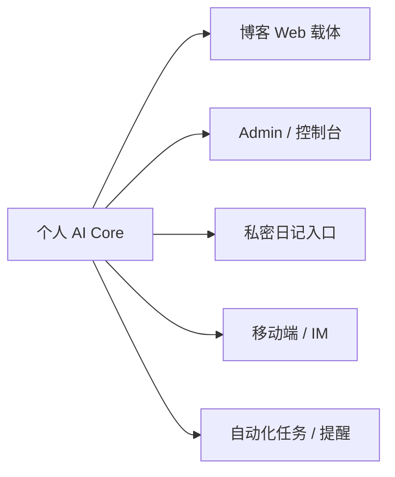

明白了，这个澄清非常关键。

这意味着你的目标其实不是“**把博客的 AI 模块做强**”，而是“**做一个以你自己为中心的个人 AI 系统，而博客只是最先落地、成本最低的一个载体**”。

这会直接改变架构结论：

- **不应该以博客为中心设计系统**
- **应该以个人 AI 内核为中心设计系统**
- 博客、管理后台、聊天界面、移动端、命令行、日记入口，都只是这个内核的不同 **channel / adapter**

所以我会把前面的结论修正成一句更准确的话：

> **核心层建议从头用 Python 重构；载体层（博客）建议基于现有项目做适配。**  
> 也就是：**“核心从头实现，接入层基于现有项目改造。”**

这和“整个系统从头写”或者“整个系统都在博客项目里改”都不一样。

## 这会带来的设计转向

### 博客从“系统本体”降级为“一个外壳”

博客现在应该只是：

- 一个展示界面
- 一个输入入口
- 一个内容沉淀载体
- 一个公开表达窗口

而不是：

- 个人 AI 的唯一运行环境
- 个人记忆的唯一存储中心
- 决策逻辑和长期陪伴逻辑的宿主

换句话说，你真正要做的是：

## 这样一来，系统分层应该改成

### 应该从头实现的部分

这些部分**不应该被博客项目绑死**，建议直接用 Python 新建：

1. **Agent Runtime**
   - 核心循环
   - 工具调度
   - 策略决策
   - 会话状态机
   - 长期记忆机制

2. **Personal Memory Vault**
   - 个人记忆库
   - 时间线
   - 关系/人物/事件
   - 反思记录
   - 成长目标、习惯、情绪轨迹
   - 删除/修订/遗忘策略

3. **Identity / Persona Layer**
   - “我是谁”
   - “我在意什么”
   - “怎样和我说话”
   - “哪些边界不能越过”

4. **Privacy / Consent / Safety Layer**
   - 数据主权
   - 本地优先 / 可导出
   - 可删除、可冻结、可回滚
   - 敏感记忆隔离
   - 情感陪伴边界和伦理约束

### 应该基于现有项目改造的部分

这些部分可以继续复用 Liutech 的能力：

1. **博客前端 / 管理后台**
   - 作为最先落地的 UI
   - 作为一个 agent channel

2. **现有内容生产链路**
   - 草稿
   - 发布
   - 标签
   - SEO
   - 内容检索

3. **已有接口契约**
   - 请求格式
   - SSE/流式输出
   - 后台调用方式

所以更准确地说：

| 层 | 建议 |
|---|---|
| 个人 AI 核心 | **从头实现** |
| 博客适配层 | **基于现有项目改造** |
| 内容工具层 | **复用 + 封装为 Python tools** |
| 长期记忆与隐私策略 | **从头实现** |
| 前端交互层 | **先复用博客，再向多载体扩展** |

## 这会改变“从头实现 vs 改造”的判断

如果博客只是载体，那么原问题应该改写成：

- **个人 AI 核心层：要不要从头实现？**
- **博客接入层：要不要基于现有项目改造？**

我的判断会变成：

### 核心层
**更偏向从头实现。**

因为你真正的核心需求已经不是“博客问答模块升级”，而是：

- 记录自己
- 理解自己
- 长期陪伴
- 成长支持
- 个性化记忆
- 情绪与伦理边界
- 数据主权

这些需求，通常都需要新的数据模型和新的运行时边界。  
如果继续把它塞进博客 AI 模块里，后面你会发现：

- 记忆模型被文章/评论/聊天数据绑死
- 权限模型被博客后台权限绑死
- UI 假设被网页交互绑死
- 能力边界被“内容生成工具”绑死

### 接入层
**更偏向基于现有项目改造。**

因为博客依然是很好的首个载体：

- 你已经有前端
- 已经有后台
- 已经有内容体系
- 已经有用户路径
- 已经有最简单的使用场景

所以博客很适合做：
- 第一阶段原型 UI
- 第一阶段内容沉淀入口
- 第一阶段 agent 的“公开人格界面”

但它不该继续承担“系统内核”。

## 如果按这个新目标，我会把路线改成

### 第一阶段
**先做“个人 AI 核心”，不是先做“博客 AI 增强”**

目标：

- Python Agent Runtime
- 统一记忆模型
- 本地/私有化存储策略
- 个人时间线与反思结构
- 基础工具系统

这阶段甚至可以先不接博客，只做一个：
- CLI
- 简单 Web 控制台
- 私密管理页

### 第二阶段
**把博客作为第一个 adapter 接进来**

让博客只做这些事：

- 展示 agent 的部分输出
- 输入个人问题 / 草稿 / 反思
- 发布经过筛选的内容
- 管理公开与私密内容的边界

### 第三阶段
**从“博客 AI”扩展成“个人 AI 系统”**

新增载体：

- 私密日记入口
- 移动端聊天
- 每日回顾 / 周报
- 成长目标追踪
- 自动提醒与复盘
- 情感低谷时的陪伴策略

## 对技术选型的影响也会变

### 之前如果以博客为中心
你会倾向于：
- 兼容现有接口
- 复用现有数据库
- 先满足写作/发布

### 现在如果以个人 AI 为中心
你应该更重视：

- **Python runtime 的独立性**
- **记忆存储的可迁移性**
- **私密数据分层**
- **导出/删除/冻结能力**
- **多载体接入能力**
- **不要让“文章”成为唯一一等对象**

也就是说，你的数据一等对象应该从：

- article
- chat
- agent_task

升级成：

- memory
- moment
- conversation
- artifact
- reflection
- goal
- habit
- relationship
- preference
- boundary

## 所以最终建议要更新为

如果你现在的真实目标是：

> “构建记录自己、理解自己、陪伴自己、帮助自己成长的个人 AI 系统”

那么最合理的路线不是：

- **把博客 AI 模块做大**

而是：

- **把博客降级成第一载体**
- **把 Python Agent 升级成第一主体**

一句话总结就是：

> **先做 Personal AI Core，再给它接一个 Blog Adapter。**

如果你愿意，我下一步可以直接基于这个澄清，给你输出一版**真正以“个人 AI 系统”为中心**的重构版方案，内容会变成：

- 个人 AI Core 的模块划分
- 记忆系统如何设计
- 隐私/删除/数据主权怎么落地
- 博客如何作为第一个 adapter 接入
- 单人开发 / 小团队的分阶段路线图
- 一版更贴合“陪伴型 AI”的 Python 项目目录结构

这样会比“博客 AI 升级方案”更贴近你的真实目标。